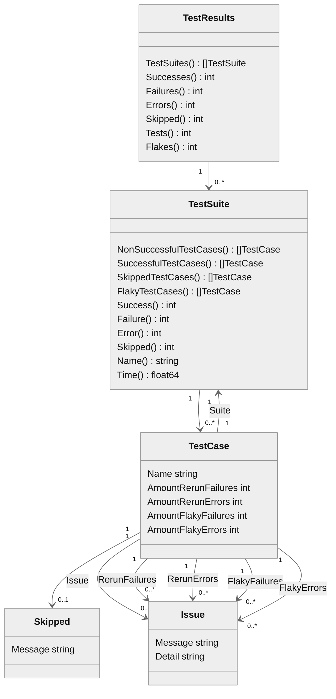

# Data Model surefire results get converted to

## Overview

## Types
- TestResults: Root object encapsulating test results
    - Tests: Returns the overall amount of tests
    - Successes: Returns the overall amount of successful tests
    - Failures: Returns the overall amount of failing tests
    - Errors: Returns the overall amount of erroneous tests
    - Skipped: Returns the overall amount of skipped tests
    - Flakes: Returns the overall amount of flaky tests
    - TestSuites: Returns all test suites. Those suites with an empty name are skipped
    
- TestSuite: Represents a surefire test suite. Carries tests from that suite and provides methods to extract tests
    - NonSuccessfulTestCases: Returns those tests which where not successful, either result in error or failure
    - SuccessfulTestCases: Returns successful tests
    - SkippedTestCases: Returns skipped tests
	- Success: Returns the amount of successful tests
	- Failure: Returns the amount of failing tests
	- Error: Returns the amount of tests in error
	- Skipped: Returns the amount of skipped tests
	- Name: Returns the name of the test suite
	- Time: Returns the amount of seconds the suite needed to run

- TestCase: Represents a surefire test suite. Carries tests from that suite and provides methods to extract tests
    - Name: The name of this test
    - Suite: Backward reference to the enclosing suite
    - Issue: When this test failed or resulted in error, return that as an Issue
    - RerunFailures: When a test failed return the RerunIssues from re-runs
    - AmountRerunFailures: The amount of re-runs when test failed
    - RerunErrors: When a test resulted in error, return the RerunIssues from re-runs
    - AmountRerunErrors: The amount of re-runs when test resulted in error
    - FlakyFailures: When a test succeeded, return the re-runs as RerunIssues
    - AmountFlakyFailures: When a test succeeded, return the amount of failures from re-runs
    - FlakyErrors: When a test resulted in error, return the re-runs as RerunIssues
    - AmountFlakyErrors: When a test resulted in error, return the amount of errors from re-runs
    - Skipped: If a test was skipped, return this

- Issue: 
    - Message: The message describing the issue
	- Detail: Details for this issue, can be assumed to be a stack trace

- RerunIssue:
    - Message: The message describing the issue
    - Stacktrace: Stacktrace for this issue
    - SystemOut: Message which appears on system-out
    - StackError: Message which appears on system-err
  
- Skipped:
    - Message: The message justifying why a test was skipped
